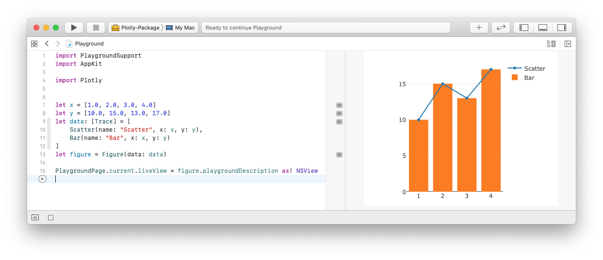

# Examples


## XCode Playground - [`Playground.xcworkspace`](Playground.playground/Contents.swift)

Getting Plotly working in an XCode playground requires an extra step because as of XCode 11 there's no support for importing modules from Swift Package Manager (SPM) packages. It's possible to work around this by generating a `Plotly.xcodeproj` project and importing it instead of the SPM package. The exact steps are described below.



 1. Generate Xcode project with the following command:
    ```shell script
    $> swift project generate-xcodeproj
    ```
    > This will create `Plotly.xcodeproj` that contains an XCode project equivalent to `Package.swift`.
2. Open  `Playground.xcworkspace` in XCode. The example blindly references  `Plotly.xcodeproj` that doesn't normally exist in the repository. It contains a simple demo playground.
    > If you are creating your own workspace from scratch then click on *File* -> *Add Files ...* menu and navigate to `Plotly.xcodeproj`.
3. Select `Plotly-Package` scheme and then manually build it via *Product* -> *Build* menu.
     > This is necesary to make `import Plotly` work. Otherwise, the playground code will fail to compile.
4. Run the code in the demo playground.
     > The key trick is the last line which sets the `liveView` property of the current Playground page to a view containing the created figure object.


## Google Colab - [`Colab.ipynb`](Colab.ipynb)

No luck there so far... Getting this to work should be easier than XCode Playground at least in principle. Jupyter Notebook is basically a HTML webpage. So passing a `<div>` to the server and rendering it should be a simple thing. The problem seems to be something general caused by incorrect message format sent to the Jupyter server from Swift.

Empty Colab notebook with Swift kernel can be started from [here](https://colab.research.google.com/github/tensorflow/swift/blob/master/notebooks/blank_swift.ipynb) and the following code snippet imports and builds the latest version of the package:
```swift
%install '.package(url: "https://github.com/vojtamolda/Plotly.swift.git", branch("master"))' Plotly
```
